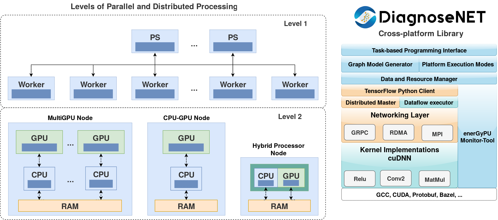

<p align="center"></p>

--------------------------------------------------------------------------------
**DiagnoseNET** is an open source framework for tailoring deep neural networks into computational architectures from CPU-GPU implementation to multi-GPU and multi-nodes with an efficient ratio between accuracy and energy consumption. It is oriented to propose a green intelligence medical workflow for deploying medical diagnostic tools inside the hospitals with minimal infrastructure requirements and low power consumption.

The first application built was to automate the [unsupervised patient phenotype representation workflow](https://link.springer.com/chapter/10.1007/978-3-030-16205-4_1) trained on a mini-cluster of Nvidia Jetson TX2. This workflow is divided into three stages: 
1. The first stage mining electronic health records for patient feature extraction and serialised each patient record in a clinical document architecture schema to create a binary patient representation.
2. The second stage embedding the patient’s binary matrix via an unsupervised learning to obtain a new latent space and identify the patient’s phenotypic representations. 
3. The last stage focuses on supervised learning using the patient's features (binary or latent representation) as an input for machine learning algorithms or as an initialiser for deep neural networks.


## Installation ##
DiagnoseNET is building on Ubuntu 16.04, with CUDA 8.0 support, cuDNN v6 for Python 3.6.
The main dependencies install:
```bash
pip3 install numpy==1.15.4, scipy==1.1.0, pandas==0.23.4, scikit-learn==0.20.1
pip3 install tensorflow-gpu==1.3.0
```
Warning for using Tensorflow-gpu.1.4.1: the module 'tensorflow.python.framework.fast\_tensor\_util' does not match with runtime Python version 3.6.

To install the current release:
```bash
git clone https://github.com/IADBproject/diagnosenet.git
```


## DiagnoseNET Cross-Platform Library ##
DiagnoseNET is extending TensorFLow library to characterize the deep learning tasks and improve the balance between accuracy and energy-efficient performance.

It is composed as: one module for write the DNN models integrated with 
a module to parallel and distributed training over diferent platforms;
a second model for data and resource manager, 
one model for energy-monitoring and other model to collect all the experiments to analyze them as shown in the next schema.

1. A multi-platform training DNN model: This module integrates a data and resource manager for training the DNN model, over: CPU-GPU desktop machines, on multi-GPU nodes or in the embedded computation cluster of Jetson TX2.

2. An energy-monitoring tool for workload characterization: This module deploys an energy monitor to collect the energy consumption metrics while the DNN model is executed on the target platform for analyzing the balance between accuracy and energy consumption.

<p align="center"></p>
